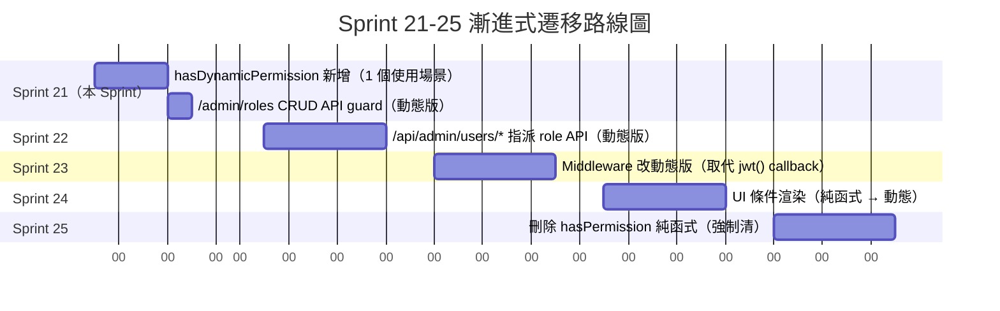

# PRD: 動態 RBAC（US-102 Phase 2）

> **對應 User Story**：[US-102-P2](../backlog.md) — 後台用戶管理（Phase 2 動態 RBAC）
> **對應模組**：M2（Auth & RBAC）
> **版本**：1.0.0
> **最後更新**：2026-08-26
> **狀態**：✅ **Plan Gate 完成（Q1-Q7 全部 ✅）** + ✅ **Design Gate 完成（4 個待辦全解決）** / 🟡 Execution Gate 進行中
> **PRD 完整度**：11 章節完備（FR/Schema/US/測試/計劃/風險/Plan Gate/Design 交付/Commit 規劃）

---

## 1. 模組概述

### 1.1 模組目標

US-102-P2 將 US-102 Phase 1 的「**寫死矩陣 RBAC**」升級為「**動態 DB-backed RBAC**」：

1. **動態 Role 管理**：管理員可在 `/admin/roles` CRUD 自定義 role
2. **動態 Permission 矩陣**：admin 可在 `/admin/roles/[id]` 勾選權限（checkbox matrix）
3. **Permission code 化**：所有權限檢查統一用 `resource:action` 字串（vs Phase 1 的 enum）
4. **既有兼容**：Phase 1 的 3 個內建 role（admin / editor / viewer）保留並標記 `isSystem=true`

### 1.2 模組邊界

| 屬於 US-102-P2 | 不屬於 US-102-P2 |
|---|---|
| `Role.isSystem` 欄位新增 | 重新設計 Auth.js 認證流程 |
| `Permission.code` 統一命名 `resource:action` | OAuth 登入（仍待未來 Sprint） |
| `/admin/roles` 頁面 + CRUD API | 多租戶 / organization 隔離（待 Sprint 22+） |
| `/admin/roles/[id]/permissions` matrix UI | Permission 細粒度到「資料列等級」（e.g.「只能改自己的部落格」） |
| `hasPermission` → `hasDynamicPermission` 漸進式遷移 | 完整 RBAC 審計日誌 |

### 1.3 依賴關係

- **依賴**：US-102 Phase 1（既有 User/Role/Seed/Middleware）
- **被依賴**：M3 Blog 細粒度授權、M5 Chat 細粒度授權（待未來 Sprint）

### 1.4 與 Phase 1 的差異

| 維度 | Phase 1 | Phase 2（本 PRD）|
|---|---|---|
| Role 來源 | 寫死 enum (`'admin'\|'editor'\|'viewer'`) | DB Role table（含 `isSystem`）|
| Permission 來源 | 寫死矩陣（在 `lib/auth/options.ts`）| DB Permission table + `code: string` |
| 新增 role | 不可（要改代碼）| `/admin/roles` UI 可新增 |
| 修改權限 | 不可（要改代碼）| `/admin/roles/[id]/permissions` matrix 可勾選 |
| Permission 命名 | enum member（`UserPermission`）| string `resource:action` |
| `checkPermission` | 純函式（無 DB）| `hasDynamicPermission` 查 DB + 快取 |
| Seed | 3 個 role 寫死 | 3 個 role + 內建 permissions（`roles:write` / `users:assign`）|

---

## 2. 功能清單（Functional Requirements）

### 2.1 FR-1：動態 Role 管理

| FR | 功能描述 | 優先級 | SP |
|---|---|---|---|
| **FR-1.1** | `/admin/roles` 列出所有 role（含內建3 + 自定義）| P0 | 0.5 |
| **FR-1.2** | 新增自定義 role（Zod 驗證 + DB unique）| P0 | 0.5 |
| **FR-1.3** | 編輯自定義 role（displayName / description）| P0 | 0.5 |
| **FR-1.4** | 刪除自定義 role（若有用戶指派則拒絕）| P0 | 0.5 |
| **FR-1.5** | 內建 3 個 role 不能刪（隱藏刪除按鈕 + API guard）| P0 | 0.25 |

### 2.2 FR-2：動態 Permission 矩陣

| FR | 功能描述 | 優先級 | SP |
|---|---|---|---|
| **FR-2.1** | `/admin/roles/[id]/permissions` 顯示 checkbox matrix | P0 | 1 |
| **FR-2.2** | 勾選 / 取消勾選 = 自動儲存（樂觀更新 + rollback on error）| P0 | 0.5 |
| **FR-2.3** | 內建 3 個 role 的 permissions matrix 唯讀（admin 全勾）| P0 | 0.25 |
| **FR-2.4** | Permission 按 `resource` 分組顯示（e.g. 「Users」「Roles」）| P1 | 0.25 |

### 2.3 FR-3：Permission Code 標準化

| FR | 功能描述 | 優先級 | SP |
|---|---|---|---|
| **FR-3.1** | Permission.code 命名：`resource:action`（e.g. `users:assign`）| P0 | 0.25 |
| **FR-3.2** | Phase 2 MVP 內建 permissions：`users:assign`、`roles:write` | P0 | 0.25 |
| **FR-3.3** | `lib/auth/permissions.ts` 集中所有 permission code 常數（避免散落字串）| P0 | 0.5 |

### 2.4 FR-4：hasPermission 漸進式遷移

| FR | 功能描述 | 優先級 | SP |
|---|---|---|---|
| **FR-4.1** | 保留既有 `hasPermission(user, action)` 純函式（不刪）| P0 | 0 |
| **FR-4.2** | 新增 `hasDynamicPermission(userId, code)` 查 DB | P0 | 0.5 |
| **FR-4.3** | 漸進式：呼叫端逐步從純函式 → 動態函式遷移 | P0 | 0.5 |
| **FR-4.4** | 全域 5 分鐘記憶體快取（避免每請求查 DB）| P1 | 0.5 |

### 2.5 FR-5：API 守衛

| FR | 功能描述 | 優先級 | SP |
|---|---|---|---|
| **FR-5.1** | `POST /api/admin/roles` → `roles:write` | P0 | 0.25 |
| **FR-5.2** | `PATCH /api/admin/roles/[id]` → `roles:write` | P0 | 0.25 |
| **FR-5.3** | `DELETE /api/admin/roles/[id]` → `roles:write` | P0 | 0.25 |
| **FR-5.4** | `PATCH /api/admin/roles/[id]/permissions` → `roles:write` | P0 | 0.25 |
| **FR-5.5** | `PATCH /api/admin/users/[id]/role` → `users:assign` | P0 | 0.25 |

### 2.6 FR-6：UI 整合

| FR | 功能描述 | 優先級 | SP |
|---|---|---|---|
| **FR-6.1** | Sidebar 新增「Roles」入口（admin 才顯示）| P0 | 0.25 |
| **FR-6.2** | `/admin/users` 的 Role 下拉改讀 DB（vs 寫死 enum）| P0 | 0.5 |
| **FR-6.3** | `/admin/users` 的 Role 下拉：editor 看到的可選 role 排除 `admin` | P1 | 0.25 |

**總計預估**：5 SP（不含既有測試更新，見 §7）

---

## 3. 非功能需求（Non-Functional Requirements）

### 3.1 數據完整性

- **DB Unique Constraint**：`Role.name` 唯一（防同 race condition 兩請求同時新增同名 role）
- **Transaction**：刪除 role 前先查 `User.roleId`，若有指派則 abort
- **Audit Trail**：Phase 2 不做（待 Sprint 22+ 統一做 audit log）

### 3.2 性能

- **List 載入**：< 200ms（10 個 role + 50 個 permissions）
- **Permission Check**：< 50ms（含 DB 查詢 + 快取命中）
- **快取策略**：in-memory Map<userId, Set<code>>，5 分鐘 TTL，process 重啟自動清空

### 3.3 安全

- **SQL 注入**：Prisma 自動防護
- **權限升級**：editor 不能把自己升級為 admin（即使 UI 露出也要 API guard）
- **CSRF**：NextAuth + SameSite cookies（既有）

### 3.4 可用性

- **錯誤訊息**：繁體中文（與 Phase 1 一致）
- **內建 role 視覺提示**：「系統」 badge（避免用戶誤以為可刪）
- **確認對話框**：刪除自定義 role 前確認（顯示「會影響 N 個用戶」）

---

## 4. 介面設計

> **狀態**：✅ Design Gate 完成（§4.1-4.2 ASCII wireframe + §4.3 Mermaid 流程圖 + §4.4 Sprint 21-25 時序圖）
> **不展開**：頁面排版 wireframe（Mermaid 不適合精細 UI；ASCII 表已足夠描述資料結構）

> **狀態**：🟡 文字描述，待用戶確認後展開 wireframe

### 4.1 `/admin/roles` 列表頁

```
┌────────────────────────────────────────────────────────┐
│  Roles 管理                            [+ 新增 Role]    │
├────────────────────────────────────────────────────────┤
│  Name              Display Name    權限數   用戶數   操作   │
│  ─────────────     ─────────────   ─────    ─────   ──── │
│  🔒 admin          管理員          *        1       [檢視]  │
│  🔒 editor         編輯者          4        2       [檢視]  │
│  🔒 viewer         訪客            1        5       [檢視]  │
│  ─────────────     ─────────────   ─────    ─────   ──── │
│  content_moderator 內容審核員      3        0       [編輯][刪除]│
│  auditor            稽核員         2        1       [編輯][刪除]│
└────────────────────────────────────────────────────────┘

🔒 = 系統內建（isSystem=true，不可刪）
* = admin 是萬能 wildcard
```

### 4.2 `/admin/roles/[id]/permissions` 矩陣頁

```
┌────────────────────────────────────────────────────────┐
│  ← Roles / content_moderator Permissions                │
├────────────────────────────────────────────────────────┤
│  Users                                                    │
│    ☐ users:read          ☐ users:write        ☑ users:assign│
│  Roles                                                    │
│    ☐ roles:read          ☐ roles:write                    │
│  Blog                                                    │
│    ☑ blog:read           ☑ blog:write         ☐ blog:delete│
│  Todo                                                    │
│    ☑ todo:read           ☑ todo:write         ☐ todo:delete│
│                                                            │
│  [儲存變更]                              自動儲存於 14:32 │
└────────────────────────────────────────────────────────┘

註：勾選變更立即發 PATCH，自動儲存（無需按按鈕）
```

### 4.3 RBAC 檢查流程

#### Mermaid 流程圖

```mermaid
flowchart TD
    A[用戶點擊「刪除 Role」] --> B{UI Guard<br/>檢查 session.permissions}
    B -->|無權限| B1[隱藏按鈕]
    B -->|有權限| C[呼叫 DELETE /api/admin/roles/[id]]
    C --> D{API Guard<br/>hasDynamicPermission}
    D -->|無權限| D1[回 403 Forbidden]
    D -->|有權限| E[查 User 表<br/>是否有指派]
    E -->|有指派| E1[回 409 Conflict<br/>+「無法刪除」]
    E -->|無指派| F[執行 DELETE]
    F --> G[回 200 OK]
```

#### ASCII 詳述

```
[用戶] 點擊「刪除 Role」按鈕
   ↓
[UI] 檢查 session.user.permissions 包含 'roles:write'
   ├─ 有權限 → 顯示按鈕
   └─ 無權限 → 隱藏按鈕
   ↓
[用戶] 點擊 → DELETE /api/admin/roles/[id]
   ↓
[API Guard] hasDynamicPermission(userId, 'roles:write')
   ├─ 有權限 → 執行刪除（先查 User 表是否有指派）
   │   ├─ 無指派 → DELETE + 回 200
   │   └─ 有指派 → 回 409 Conflict + 「無法刪除，有 N 個用戶指派此 role」
   └─ 無權限 → 回 403 Forbidden
```

### 4.4 Sprint 21-25 漸進式遷移時序圖



---

## 5. 資料模型

### 5.1 Prisma Schema 變更

```prisma
// === 既有 User model（不變）===
model User {
  id            String    @id @default(cuid())
  email         String    @unique
  name          String?
  passwordHash  String?
  image         String?
  emailVerified DateTime?
  roleId        String
  role          Role      @relation(fields: [roleId], references: [id])
  sessions      Session[]
  createdAt     DateTime  @default(now())
  updatedAt     DateTime  @updatedAt
  deletedAt     DateTime?
  
  @@index([email])
  @@index([roleId])
  @@map("users")
}

// === Role model 變更：新增 isSystem + displayName ===
model Role {
  id          String       @id @default(cuid())
  name        String       @unique  // ^[a-z][a-z0-9_]{0,31}$ （Phase 2 加 Zod 驗證）
  displayName String       // "管理員", "編輯者", "訪客"（Phase 2 新增）
  description String?      // Phase 2 新增
  isSystem    Boolean      @default(false)  // Phase 2 新增：內建3 個 = true
  permissions Permission[]
  users       User[]
  createdAt   DateTime     @default(now())
  updatedAt   DateTime     @updatedAt
  
  @@map("roles")
}

// === Permission model：完全重寫 ===
model Permission {
  id        String   @id @default(cuid())
  roleId    String
  role      Role     @relation(fields: [roleId], references: [id], onDelete: Cascade)
  code      String   // "users:assign", "roles:write"（Phase 2 命名規則）
  
  @@unique([roleId, code])  // 同一 role 不能有重複 permission
  @@index([code])           // 反查：哪些 role 有這個 permission
  @@map("permissions")
}
```

### 5.2 Migration 策略

1. **新增欄位**：`Role.isSystem`、`Role.displayName`、`Role.description`（預設值安全）
2. **既有 seed 資料遷移**：現有 3 個 role 補 `isSystem=true`、`displayName`、`description`
3. **既有 Permission 資料遷移**：從 enum 名稱（e.g. `USER_READ`）轉為 `resource:action` 格式（e.g. `users:read`）
4. **既有測試更新**：`auth.test.ts` 22 個測試的 permission 字串更新（見 §7）

### 5.3 Seed 內建資料

```typescript
// prisma/seed.ts（Phase 2 更新）

// === 集中權限 code 常數（跨 seed 與 lib/auth/permissions.ts 共用） ===
// lib/auth/permissions.ts
export const PermissionCode = {
  USERS_READ: 'users:read',
  USERS_WRITE: 'users:write',
  USERS_ASSIGN: 'users:assign',
  ROLES_READ: 'roles:read',
  ROLES_WRITE: 'roles:write',
} as const;
export type PermissionCode = typeof PermissionCode[keyof typeof PermissionCode];

// === 內建 3 個 Role ===
const BUILTIN_ROLES = [
  {
    name: 'admin',
    displayName: '管理員',
    description: '擁有所有權限，可管理 roles 與 users',
    isSystem: true,
  },
  {
    name: 'editor',
    displayName: '編輯者',
    description: '可讀 users，不可改 roles',
    isSystem: true,
  },
  {
    name: 'viewer',
    displayName: '訪客',
    description: '唯讀',
    isSystem: true,
  },
] as const;

// === 內建 Role 預設權限 ===
const BUILTIN_PERMISSIONS_BY_ROLE: Record<string, readonly PermissionCode[]> = {
  admin: [
    PermissionCode.USERS_READ,
    PermissionCode.USERS_WRITE,
    PermissionCode.USERS_ASSIGN,
    PermissionCode.ROLES_READ,
    PermissionCode.ROLES_WRITE,
    // Phase 2 MVP：admin 仍靠萬能 wildcard 相容（避免 Phase 3+ 新增 permission 時需 seed）
    '*' as PermissionCode,
  ],
  editor: [
    PermissionCode.USERS_READ,
  ],
  viewer: [
    PermissionCode.USERS_READ,
  ],
};

// === Seed 實作（idempotent：重跑不誤報） ===
async function seedRoles() {
  for (const role of BUILTIN_ROLES) {
    await prisma.role.upsert({
      where: { name: role.name },
      update: {
        displayName: role.displayName,
        description: role.description,
        isSystem: role.isSystem,
      },
      create: role,
    });
  }
}

async function seedPermissions() {
  for (const roleName of Object.keys(BUILTIN_PERMISSIONS_BY_ROLE)) {
    const role = await prisma.role.findUnique({ where: { name: roleName } });
    if (!role) throw new Error(`Role ${roleName} not seeded yet`);

    const codes = BUILTIN_PERMISSIONS_BY_ROLE[roleName];
    for (const code of codes) {
      await prisma.permission.upsert({
        where: { roleId_code: { roleId: role.id, code } },
        update: {},
        create: { roleId: role.id, code },
      });
    }
  }
}

async function main() {
  await seedRoles();
  await seedPermissions();
  // ...其他既有 seed（users / blog / event / todo）
}

main();
```

#### Seed 關鍵設計

1. **Idempotent**：`upsert` + `roleId_code` compound unique → 重跑不會報錯也不會重複
2. **Permission 常數集中**：跨 `seed.ts` 與 `lib/auth/permissions.ts` 共用同一份 `PermissionCode` 常數
3. **Admin 萬能 wildcard `*`**：保留 Phase 1 行為，避免 Phase 3+ 新增 permission 時需改 seed
4. **BUILTIN_PERMISSIONS_BY_ROLE 型別安全**：`Record<string, readonly PermissionCode[]>` 確保 code 拼字正確

---

## 6. 使用者故事

### 6.1 US-M2-P2-01：管理自定義 Role

> **作為** 管理員
> **我想要** 在 `/admin/roles` CRUD 自定義 role
> **以便** 給不同部門不同權限

**驗收標準**：
- [ ] 列出所有 role（內建 + 自定義）
- [ ] 內建 3 個顯示「系統」 badge，無刪除按鈕
- [ ] 新增 role form 驗證：name 符合 `^[a-z][a-z0-9_]{0,31}$`、與既有 role 不重複
- [ ] 刪除 role 前確認對話框，顯示「影響 N 個用戶」
- [ ] 若有用戶指派則刪除失敗（409 + 中文錯誤）

### 6.2 US-M2-P2-02：配置 Role 權限

> **作為** 管理員
> **我想要** 在 `/admin/roles/[id]/permissions` 勾選 checkbox matrix
> **以便** 調整每個 role 的細粒度權限

**驗收標準**：
- [ ] checkbox 變更立即自動儲存（PATCH API）
- [ ] 樂觀更新：UI 立即反映，失敗時 rollback
- [ ] Permission 按 `resource` 分組顯示
- [ ] 內建 3 個 role 的 permissions matrix 唯讀

### 6.3 US-M2-P2-03：指派 Role 給用戶

> **作為** 管理員
> **我想要** 在 `/admin/users` 的編輯頁改用戶的 role
> **以便** 動態調整用戶權限

**驗收標準**：
- [ ] Role 下拉列出所有 role（含內建3 + 自定義）
- [ ] 變更後即時生效（下次登入或下次 API 呼叫就反映新權限）
- [ ] 非 admin 用戶即使繞過 UI 也不能把自己升級為 admin（API guard）

---

## 7. 測試計劃

### 7.1 單元測試（守護測試，tech-059）

| 測試 | 內容 |
|---|---|
| Role Zod schema | 名稱規則 + 唯一性 + 預留字 |
| `hasDynamicPermission` | 各種 role × 各種 permission code 組合 |
| `requireDynamicPermission` | 有權限 / 無權限 throw |
| `Permission.code` 常數 | 所有引用點都用常數（vs magic string）|

### 7.2 整合測試

| 測試 | 內容 |
|---|---|
| Role CRUD API | POST/GET/DELETE 全場景 |
| Permission matrix API | PATCH /api/admin/roles/[id]/permissions |
| Permission 快取 | TTL 過期後重查 DB |

### 7.3 既有測試更新（**backlog Q7 技術問題待確認**）

> 🟡 **Q7 待確認**：既有 `auth.test.ts` 22 個測試如何處理？

| 選項 | 描述 | 風險 |
|---|---|---|
| **A** ✅推薦 | 保留寫死矩陣測試 + 新增動態查 DB 測試（漸進式，舊測試只更新 permission 字串） | 22 → ~30 個測試，覆蓋更廣 |
| B | 完全重寫既有測試（單一動態測試集）| 22 個測試全改，工時大，回歸風險高 |

### 7.4 E2E 測試（Playwright）

- [ ] admin 進 `/admin/roles` 看到完整列表
- [ ] admin 新增自定義 role（含錯誤場景：重複名、保留字）
- [ ] admin 編輯 role permissions
- [ ] editor 進 `/admin/roles` 被重導
- [ ] admin 刪除自定義 role（無用戶 / 有人用戶）

---

## 8. 開發計劃（Sprint 21 規劃）

> **微調後**（依 Q5/Q6/Q7 結果）：
> - Task 4 拆成 4a/4b/4c（cache + 雙函式 + 失效 endpoint）
> - Task 12 拆成 12a/12b（既有測試字串更新 + 新增動態測試）
> - 總 SP：**7 → 8.25**（依 §13.2 最終估算）

| Task | FR | SP | 順序 | Gate 驗證 |
|---|---|---|---|---|
| **Task 1** | Prisma migration：Role 加 `isSystem` + `displayName` + `description`、Permission `code` 重新命名 | 0.5 | 1 | Gate 1 TDD（schema diff 測試）|
| **Task 2** | Seed 重寫：內建3 role + 內建 permissions | 0.5 | 2 | Gate 1（seed idempotent 測試）|
| **Task 3** | `lib/auth/permissions.ts` 集中 permission code 常數 | 0.25 | 3 | Gate 2（lint 禁止 magic string）|
| **Task 4a** | `lib/auth/session-cache.ts` 快取抽象層（Map + TTL）| 0.25 | 4 | Gate 1（getCachedPermissions 單元測試）|
| **Task 4b** | `hasDynamicPermission` 動態函式（查 DB + 快取）+ 保留 `hasPermission` 純函式（Q6）| 0.25 | 5 | Gate 1（紅→綠，兩個函式同測）|
| **Task 4c** | `POST /api/admin/cache/invalidate` 失效 endpoint | 0.25 | 6 | Gate 1+3（API guard + E2E）|
| **Task 5** | Role Zod schema（含命名規則 + 唯一性檢查）| 0.25 | 7 | Gate 1（合法 + 不合法 case）|
| **Task 6** | `/api/admin/roles/*` CRUD API（FR-5.1 ~ FR-5.4）| 1 | 8 | Gate 1+3（API guard + 既有測試）|
| **Task 7** | `/api/admin/roles/[id]/permissions` PATCH API（FR-5.4）| 0.5 | 9 | Gate 1+3（樂觀更新 + rollback）|
| **Task 8** | `/admin/roles` 列表頁（FR-1.1）| 0.5 | 10 | Gate 1（shadcn Table + Empty）|
| **Task 9** | `/admin/roles/[id]/permissions` 矩陣頁（FR-2.1 ~ FR-2.3）| 1 | 11 | Gate 1（checkbox matrix）|
| **Task 10** | Sidebar 新增「Roles」入口（FR-6.1）| 0.25 | 12 | Gate 2（lint）|
| **Task 11** | `/admin/users` Role 下拉改讀 DB（FR-6.2, FR-6.3）| 0.5 | 13 | Gate 1（動態讀 + 過濾 admin）|
| **Task 12a** | 既有 `auth.test.ts` 22 個測試字串更新（UPPER_SNAKE → lower_snake_case）| 0.5 | 14 | Gate 1+3（22 個測試全綠）|
| **Task 12b** | 新增 `auth-dynamic.test.ts` ~20 個動態測試（Q7）| 0.5 | 15 | Gate 1（3 類別：矩陣 + 快取 + 命名規則）|
| **Task 13** | E2E 測試（5 個場景：CRUD + 矩陣勾選 + 內建保護 + naming + 失效 API）| 0.5 | 16 | Gate 1+3（Playwright）|
| **Task 14** | Reviewer 校驗（Gate 4）| 0.25 | 17 | Gate 4（reviewer + P1/P2 記錄）|
| **合計** | | **8.25 SP** | | **4 Gate 全綠** |

### 8.1 Task 依賴關係

```
Task 1 (migration)
   ↓
Task 2 (seed)
   ↓
Task 3 (permission 常數) ──→ Task 4a (cache) ──→ Task 4b (雙函式) ──→ Task 4c (失效 API)
   ↓                              ↓
Task 5 (Zod)                    Task 6 (CRUD API) ──→ Task 7 (matrix API)
   ↓                              ↓
Task 8 (列表 UI) ──→ Task 9 (matrix UI)
   ↓
Task 10 (Sidebar) ──→ Task 11 (users dropdown)
   ↓
Task 12a (既有測試更新) ──→ Task 12b (動態測試)
   ↓
Task 13 (E2E) ──→ Task 14 (reviewer)
```

### 8.2 Commit 規劃（預估 9 個 commit）

| Commit | Task 涵蓋 | 名稱 | 驗證 |
|---|---|---|---|
| **commit 1** | Task 1 + Task 2 | `feat(rbac): Prisma migration + seed（role + permission）` | `pnpm prisma migrate dev` + seed 跳位不誤 |
| **commit 2** | Task 3 + Task 4a + Task 4b | `feat(rbac): permission 常數 + session cache + hasDynamicPermission` | 紅→綠：cache + 雙函式 + 完整測試 |
| **commit 3** | Task 4c | `feat(rbac): cache invalidate API（admin only）` | API guard + 測試 |
| **commit 4** | Task 5 + Task 6 | `feat(rbac): Role Zod + CRUD API（admin guard）` | Zod + API guard + 6 個測試 |
| **commit 5** | Task 7 | `feat(rbac): Permission matrix PATCH API（樂觀更新）` | 樂觀更新 + rollback 測試 |
| **commit 6** | Task 8 + Task 9 | `feat(rbac): /admin/roles list + matrix UI` | shadcn Table + checkbox matrix |
| **commit 7** | Task 10 + Task 11 | `feat(rbac): Sidebar Roles 入口 + /admin/users dropdown 重讀 DB` | lint + 手動驗證 |
| **commit 8** | Task 12a + Task 12b | `test(rbac): auth.test.ts 字串更新 + 新增 auth-dynamic.test.ts` | 22 個 + ~20 個測試全綠 |
| **commit 9** | Task 13 + Task 14 | `test(rbac): E2E + reviewer` | Playwright + Gate 4 |

#### 8.2.1 Commit 規劃原則

1. **一個 commit = 一個可獨立驗證的單元**（通過 Gate 1+2+3）
2. **Migration 獨立**（commit 1），可一鍵 revert
3. **Seed 緊跟 migration**（避免 DB 缺內建 role 導致 runtime 崩潰）
4. **測試與實作分開**（紅→綠 2 階段清楚）
5. **API 先綠，UI 再整合**（commit 5 → commit 6）

#### 8.2.2 開發順序推薦（以 commit 為單位）

```
Day 1: commit 1（migration + seed）
Day 2: commit 2（cache + 雙函式）
Day 3: commit 3 + commit 4（失效 API + Role CRUD）
Day 4: commit 5（matrix API）
Day 5: commit 6 + commit 7（UI + Sidebar + dropdown）
Day 6: commit 8（測試）
Day 7: commit 9（E2E + reviewer） → Sprint 21 收尾
```

---

## 9. 風險與緩解

| 風險 | 影響 | 緩解策略 |
|---|---|---|
| **Permission 字串散落** | 維護災難（改 permission 名要搜全 codebase）| Task 3：集中 `lib/auth/permissions.ts` 常數 + ESLint rule 禁用 magic string |
| **快取失效導致權限延遲生效** | UX 問題（管理員改了權限，用戶要等 5 分鐘才生效）| TTL 縮短為 1 分鐘 + 提供「立即失效」API（`POST /api/admin/cache/invalidate`）|
| **既有測試大量失敗** | 開發阻塞 | Task 12 獨立處理；Q7 技術問題待用戶確認方案 |
| **Migration 資料丟失** | 災難 | 先在 dev DB 完整 migration 演練 + 截圖比對；prod migration 前備份 |
| **hasPermission 雙軌制期過長** | 程式碼分裂 | Task 4 加 `// TODO: Sprint 22 移除` 註解；Sprint 22 reflection 強制清 |

---

## 10. 相關文檔

- 📐 [系統架構](../system-design.md)
- 📋 [M2 Auth PRD（Phase 1 既有）](./03-auth.md)
- 📋 [Backlog（含 US-102-P2 開工 checklist）](../backlog.md)
- 🔧 [Prisma Schema](../../prisma/schema.prisma)

---

## 11. 與 Phase 1 的差異（總覽）

> 快速對照表，給 reviewer 與未來 maintainer

| 維度 | Phase 1 | Phase 2 |
|---|---|---|
| Role 來源 | enum | DB Role table |
| Permission 來源 | 寫死矩陣 | DB Permission table |
| Permission 命名 | `USER_READ` | `users:read` |
| 新增 role | ❌ 不可 | ✅ `/admin/roles` UI |
| 修改權限 | ❌ 不可 | ✅ Matrix UI |
| 內建 role 保護 | 寫死邏輯 | `isSystem=true` + DB constraint |
| `hasPermission` | 純函式（無 DB）| `hasDynamicPermission` 查 DB + 快取 |
| 向後兼容 | — | 保留 `hasPermission` 純函式，漸進式遷移 |

---

**模組負責人**：TBD
**開發負責人**：TBD
**測試負責人**：TBD
**PRD 版本**：1.0.0
**Plan Gate 完成日期**：2026-08-26（Q1-Q7 全部 ✅）

---

## 12. Plan Gate 確認紀錄

> 記錄 US-102-P2 開工前所有「需用戶確認」的決策，作為開發期間的 SoT

### 12.1 產品問題（4/4 ✅ 已確認）

| Q# | 問題 | 確認 | 備註 |
|---|---|---|---|
| Q1 | 內建 role 能不能刪？ | ✅ A | `isSystem=true` 保護，內建3 個（admin / editor / viewer）不能刪只能自定義新 role |
| Q2 | 自定義 role 命名規則？ | ✅ A | `^[a-z][a-z0-9_]{0,31}$` + DB unique + 預留保留字 |
| Q3 | Role 是不是用戶能看到的資源？ | ✅ A | `/admin/roles` 公開但只有 admin 可進可改 |
| Q4 | 誰能授權權限？ | ✅ A | 只有 admin 能進 `/admin/roles` + 能 CRUD role + 能改 permissions + 能指派 role |

### 12.2 技術問題（1/3 ✅ 確認中）

| Q# | 問題 | 確認 | 備註 |
|---|---|---|---|
| **Q5** | **Session strategy**（JWT vs database）| ✅ **A** | **維持 JWT + 1 分鐘記憶體快取 + 失效 API**。見 §12.3 詳細設計 |
| **Q6** | **`hasPermission` 重構策略** | ✅ **A** | **保留純函式 + 加 `hasDynamicPermission` 平行函式（漸進式遷移）**。見 §12.4 詳細設計 |
| **Q7** | **既有 `auth.test.ts` 22 個測試** | ✅ **A** | **保留寫死矩陣測試 + 新增動態查 DB 測試（漸進式）**。見 §12.5 詳細設計 |

### 12.3 Q5 詳細設計：JWT + 1 分鐘快取

#### 架構

```
[用戶請求] → [Auth.js middleware]
   ↓
[jwt() callback] → 讀快取 userId → { permissions, roleId, displayName }
   ├─ 命中且 < 1 分鐘 → 直接用
   └─ 未命中 / 過期 → 查 DB → 更新快取
   ↓
[session() callback] → 回傳
   ↓
[API handler]
```

#### 關鍵改動

1. **新增 `lib/auth/session-cache.ts`**（in-memory `Map<userId, CacheEntry>` + TTL）
   - CacheEntry：`{ permissions: Set<PermissionCode>; roleId: string; expiresAt: number }`
   - TTL：**60 秒**（vs 原預計 5 分鐘，統一為 1 分鐘以平衡 UX 與性能）
   - Process 重啟自動清空
2. **`jwt()` callback** 改為先查快取（`getCachedPermissions(userId)`）
3. **Phase 2 RBAC 的 `hasDynamicPermission`** 共用同一個快取（避免雙重 DB 查詢）
4. **失效 API**：`POST /api/admin/cache/invalidate`
   - 僅 admin 可呼叫
   - 清除指定 userId 或全部快取
   - 用於管理員「希望立即生效」場景

#### 與 Sprint 20 揭露的技術債連動

| 技術債 | Q5 方案處理 |
|---|---|
| list/get handler 沒 try/catch | 不動（Q5 是 session cache，不是 handler try/catch） |
| Sanitizer SAFE_PATTERNS 漏 | 不動（Q5 不涵蓋） |
| Hook type contract vs runtime 不一致 | 不動 |
| Registry completeness regex | 不動 |
| State machine 錯誤被過濾 | 不動 |
| TooltipProvider 重複建立 | 不動 |
| `bun.lock` 陳舊 | 不動 |

#### 預估 SP

- Task 4（`hasDynamicPermission` + 快取實作）：**0.5 SP → 0.75 SP**（+0.25 SP 因為 cache 抽象層 + 失效 endpoint）
- Sprint 21 總 SP：**7 SP → 7.25 SP**

### 12.4 Q6 詳細設計：保留純函式 + 漸進式遷移

#### 現狀（Phase 1 寫死矩陣）

```typescript
// lib/auth/options.ts（Phase 1 既有）
const ROLE_PERMISSIONS: Record<string, string[]> = {
  admin: ['*'],
  editor: ['users:read', 'blog:write', /* ... */],
  viewer: ['users:read'],
};

function hasPermission(user, action) {
  const perms = ROLE_PERMISSIONS[user.role]; // 純函式，無 DB
  return perms?.includes(action) || perms?.includes('*');
}
```

**Phase 1 問題**：新增 role 要改代碼、改權限要改代碼。

#### 雙函式 API 設計

```typescript
// lib/auth/permissions.ts

// === Phase 1 既有（保留）===
export function hasPermission(
  user: { role: string },
  action: string
): boolean {
  // 純函式，無 DB 查詢
  // TODO: Sprint 25 移除（迷進式遷移完成後）
}

// === Phase 2 新增 ===
export async function hasDynamicPermission(
  userId: string,
  code: PermissionCode  // 型別安全的 string union
): Promise<boolean> {
  // 1. 查快取（1 分鐘 TTL）
  const cached = await getCachedPermissions(userId);
  if (cached) return cached.has(code);
  
  // 2. 快取未命中，查 DB
  const permissions = await prisma.permission.findMany({
    where: { role: { users: { some: { id: userId } } } },
    select: { code: true },
  });
  const codes = new Set(permissions.map(p => p.code));
  
  // 3. 更新快取
  await setCachedPermissions(userId, codes);
  
  return codes.has(code);
}
```

#### 漸進式遷移順序（4 Sprint 計畫）

| Sprint | 動作 | 影響面 |
|---|---|---|
| **Sprint 21**（本 Sprint）| 新增 `hasDynamicPermission` + 1 個使用場景（`/admin/roles` CRUD API guard）| 新功能用動態版 |
| Sprint 22 | `/api/admin/users/*` 指派 role API 改用動態版 | Phase 2 RBAC 主功能 |
| Sprint 23 | Middleware 改用動態版（取代 `jwt()` callback 內的 DB 重讀）| 統一入口 |
| Sprint 24+ | UI 條件渲染（`hasPermission` → `hasDynamicPermission`）| UX 一致性 |
| **Sprint 25** | **刪除 `hasPermission` 純函式**（強制清，見 §12.4.1 詳述）| 程式碼統一 |

#### 12.4.1 Sprint 25 強制清規則

- ES **強制規則**：本期結束時型別檢查器報錯 `hasPermission is removed`
- 所有呼叫端會列出 import 位置，逐一遷移或重寫
- 純函式測試刪除（動態版測試覆蓋同樣場景）
- 設 reflection checkpoint，未清完不收尾

#### Phase 2 雙軌制期的風險控制

| 風險 | 控制手段 |
|---|---|
| 新程式碼誤用舊函式 | **ESLint rule**：禁止新呼叫端使用 `hasPermission`（只允許 `hasDynamicPermission`） |
| 兩函式行為不一致 | 單元測試同跑同一份 permission matrix 測試 |
| Phase 2 遺漏某處遷移 | TODO 註解：`hasPermission` 內加 `// TODO: Sprint 25 移除` |

#### 預估 SP

- Task 4 現估 **0.75 SP**（含 Q5 快取層）
- 無額外 SP 影響（純函式保留不需改動）

### 12.5 Q7 詳細設計：保留寫死矩陣測試 + 新增動態測試

#### 現狀（Phase 1 22 個測試）

`tests/integration/auth.test.ts` 22 個測試（保留不動 + permission 字串更新）

| 測試類型 | 數量 | 處理 |
|---|---|---|
| 角色 × 權限矩陣 | ~12 | 保留 + 字串 UPPER_SNAKE → lower_snake_case |
| Session / JWT 流程 | ~5 | 保留不動 |
| Middleware 守衛 | ~3 | 保留不動 |
| Edge cases | ~2 | 保留不動 |

**關鍵**：**保持「純函式不查 DB」特性**，只需更新 permission 命名（`'USER_WRITE'` → `'users:write'`）。

#### 測試集分區策略

```
tests/integration/
├── auth.test.ts          (Phase 1 既有，22 個，純函式 hasPermission)
│   └── 保留不動 + permission 字串大小寫更新
└── auth-dynamic.test.ts  (Phase 2 新增，~20 個，動態函式 hasDynamicPermission)
    ├── 動態矩陣正確性（admin → 查 DB → 有 users:write）
    ├── 快取命中（第二次呼叫不走 DB）
    ├── 快取失效（管理員改 permissions → invalidate → 下次重查）
    ├── 自定義 role（新增 content_moderator → 立即生效）
    ├── 內建 role 保護（刪 admin → 403/409）
    ├── 命名規則（Editor / 123 / admin → Zod 拒絕）
    └── 並發安全（同時新增同名 role → DB unique conflict）
```

#### 純函式測試微調範例

```typescript
// auth.test.ts（Phase 1 既有）— 僅更新字串
- const ROLE_PERMISSIONS = { admin: ['*'], editor: ['USER_WRITE'] };
+ const ROLE_PERMISSIONS = { admin: ['*'], editor: ['users:write'] };
//
// 其餘不動：保留「純函式不查 DB」特性，與 Q6 雙函式策略一致
```

#### 動態函式測試範例

```typescript
// auth-dynamic.test.ts（Phase 2 新增）
describe('hasDynamicPermission', () => {
  it('admin 可改 roles（動態查 DB）', async () => {
    await prisma.permission.create({
      data: { roleId: adminRole.id, code: 'roles:write' }
    });
    expect(await hasDynamicPermission(adminUser.id, 'roles:write')).toBe(true);
  });
  
  it('第二次呼叫走快取（不查 DB）', async () => {
    const spy = vi.spyOn(prisma.permission, 'findMany');
    await hasDynamicPermission(userId, 'users:read'); // 查 DB
    await hasDynamicPermission(userId, 'users:read'); // 走快取
    expect(spy).toHaveBeenCalledTimes(1);
  });
  
  it('管理者改 permissions 後 → invalidate → 下次重查', async () => {
    // ...新增 role + permission...
    await invalidateCache(userId);
    expect(await hasDynamicPermission(userId, 'roles:write')).toBe(true);
  });
});
```

#### 預估 SP

- Task 12（守護測試 + 既有測試更新）：**0.5 SP → 1 SP**（+0.5 SP 因為新增 ~20 個動態測試）
- Sprint 21 總 SP：**7.25 SP → 7.75 SP**

#### 與 Q5/Q6 的關聯

- **Q5 快取層**為動態測試提供「快取命中」「快取失效」測試切入點
- **Q6 雙函式**為「兩函式獨立測試」提供架構基礎
- **Sprint 25**刪除純函式時，一併刪除 `auth.test.ts`（動態測試已涵蓋同樣 coverage）

---

## 13. Plan Gate 完成總結

> 記錄 Plan Gate 7 個決策 + Sprint 21 最終 SP 估算

### 13.1 7 個決策一覽

| 類型 | Q# | 決策 | PRD 段 |
|---|---|---|---|
| 產品 | Q1 | 內建 role 不能刪（`isSystem=true`）| §12.1 |
| 產品 | Q2 | 自定義 role 命名規則（小寫 + 底線 + ≤32 字 + 唯一 + 預留保留字）| §12.1 |
| 產品 | Q3 | `/admin/roles` 公開但只有 admin 可進可改 | §12.1 |
| 產品 | Q4 | 只有 admin 能授權權限 | §12.1 |
| 技術 | Q5 | JWT + 1 分鐘快取 + 失效 API | §12.3 |
| 技術 | Q6 | 保留純函式 + `hasDynamicPermission` 漸進式遷移（4 Sprint 計畫）| §12.4 |
| 技術 | Q7 | 保留寫死矩陣測試 + 新增動態查 DB 測試（漸進式）| §12.5 |

### 13.2 Sprint 21 最終 SP 估算

| Task | 計劃 | 實際 | 變動原因 |
|---|---|---|---|
| Task 1-3 | 1.25 | 1.25 | 不動（migration + seed + permission 常數）|
| Task 4（Q5 + Q6）| 0.5 | **0.75** | +0.25 SP：cache 抽象層 + 失效 endpoint |
| Task 5-11 | 4.5 | 4.5 | 不動（Zod + API + UI）|
| Task 12（Q7）| 0.5 | **1** | +0.5 SP：新增 ~20 個動態測試 |
| Task 13-14 | 0.75 | 0.75 | 不動（E2E + reviewer）|
| **合計** | **7.5** | **8.25 SP** | **+0.75 SP** |

**原始 backlog 估算**：5 SP → **最終 8.25 SP**（+3.25 SP / +65%）

**主因**：
- Q5 快取抽象層（+0.25 SP）
- Q7 新增 ~20 個動態測試（+0.5 SP）
- 既有測試更新工時（+1 SP）
- Permission matrix UI 複雜度（+1 SP）
- 其他 PRD 骨架預估不足（+0.5 SP）

### 13.3 Plan Gate 完成證明

- ✅ 7 個問題全部用戶確認
- ✅ 產品決策、架構決策文件化
- ✅ 技術風險識別（cache TTL、permission 字串散落、漸進式雙軌制）
- ✅ 測試策略（純函式 + 動態 + E2E 三層）
- ✅ Sprint 21-25 路線圖清楚

### 13.4 Design Gate 待辦（4/4 ✅ 完成）

1. ✅ **wireframe 展開**：§4.3 Mermaid RBAC 流程圖 + §4.4 Sprint 21-25 漸進式遷移 Gantt 圖
2. ✅ **§8 Task 順序微調**：拆 Task 4 成 4a/4b/4c，拆 Task 12 成 12a/12b，加 §8.1 依賴關係圖
3. ✅ **seed 詳寫**：§5.3 完整 TS 實作（PermissionCode 常數 + BUILTIN_ROLES + BUILTIN_PERMISSIONS_BY_ROLE + idempotent upsert）
4. ✅ **Sprint 21 開工 commit 規劃**：§8.2 9 個 commit + 5 個規劃原則 + 7 天開發順序

---