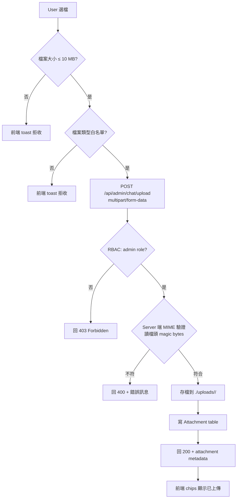
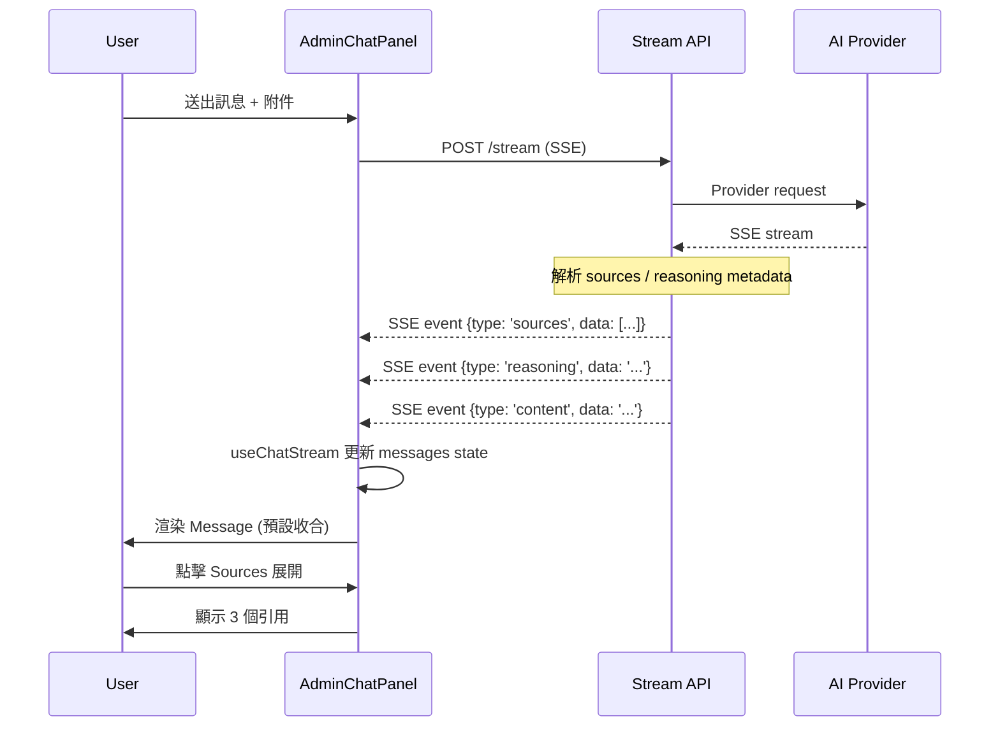
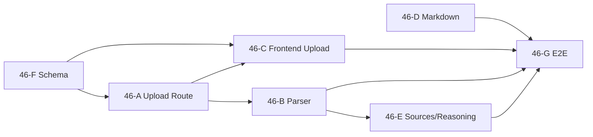
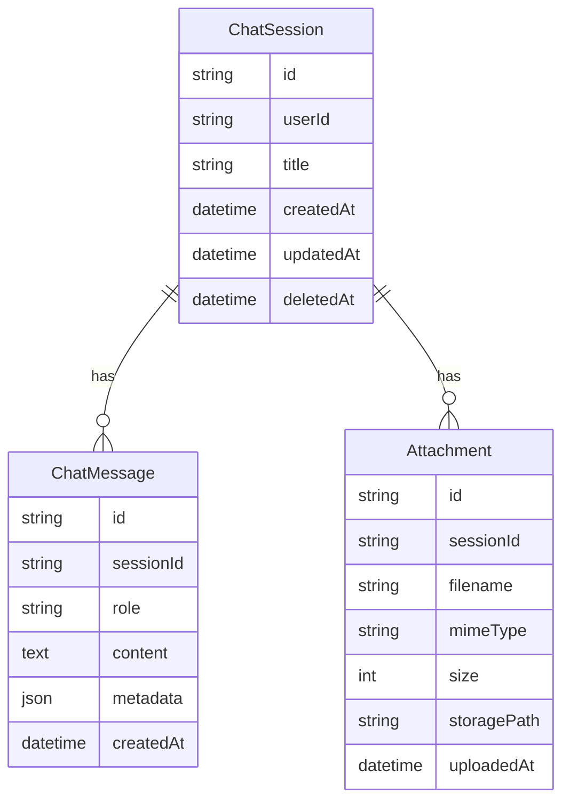

# PRD: Chat 附件上傳 + 進階 Markdown + Sources/Reasoning（Sprint 46）

> **對應 User Story**：Sprint 46 三主題並進
> **對應模組**：M5（AI Chat）
> **版本**：1.0.0
> **最後更新**：2026-08-31
> **狀態**：✅ **Plan Gate 完成（17 個決策全部 ✅）** + 🟡 **Design Gate 進行中**
> **PRD 完整度**：12 章節完備（FR/Schema/US/測試/計劃/風險/Plan Gate/Design 交付/Commit 規劃/架構演進）
> **Plan Gate 文件**：[docs/sprint46-plan-gate.md](../sprint46-plan-gate.md)

---

## 1. 模組概述

### 1.1 Sprint 46 目標

Sprint 46 在 Sprint 44-45 已實作的 AI Chat 基礎上，補齊三個「內容擴展」主題：

1. **真實附件上傳**：從 Sprint 45 的純前端 UI 升級為「真實上傳 → 解析 → 進 prompt context」完整 pipeline
2. **進階 Markdown**：從 Sprint 45 的「只支援 code block」升級為「完整 GFM Markdown」（react-markdown + remark-gfm）
3. **自製 Sources/Reasoning UI**：在保留 Sprint 43 Custom URL Provider 架構下，從 AI 回應 metadata 自製兩元件

### 1.2 為什麼這三個主題放一個 Sprint？

- **依賴鏈**：附件上傳的圖片 vision → 與 Markdown 完整渲染 → 與 Sources 顯示，都是同一條「AI 回應增強」chain
- **架構一致**：三者都圍繞 `useChatStream` 與 AI Elements Message 元件擴展
- **測試同質**：都是「前端元件 + 後端 route + DB」三層測試 pattern

### 1.3 模組邊界

| 屬於 Sprint 46 | 不屬於 Sprint 46 |
|---|---|
| 附件上傳 route + 本機 storage | 雲端 storage（S3 / Vercel Blob） |
| PDF / DOCX / XLSX / PPTX 解析 | OCR / 掃描文件識別 |
| 圖片 vision（Custom URL Provider 支援的）| 圖片本地 OCR / Tesseract |
| react-markdown + remark-gfm | Mermaid 圖表 / LaTeX 數學公式 |
| 自製 Sources / Reasoning UI | 訊息編輯 / 重新生成 |
| 附件永久保留 | RAG / 向量資料庫 / Chunking |
| MIME 白名單 + RBAC | 病毒掃描（ClamAV）|

### 1.4 與 Sprint 45 的差異

| 維度 | Sprint 45 | Sprint 46（本 PRD）|
|---|---|---|
| 附件 UI | ✅ 純前端（選檔、chips、移除）| ✅ 同上 + 真實上傳 + 進度條 + 錯誤顯示 |
| 上傳 route | ❌ 未實作 | ✅ `/api/admin/chat/upload` + RBAC + MIME 白名單 + 10 MB 上限 |
| Storage | ❌ 無 | ✅ 本機 `./uploads/`，session 永久保留 |
| 解析 | ❌ 無 | ✅ PDF (pdf-parse) + DOCX/PPTX (mammoth) + XLSX (xlsx) + 純文字直讀 + 圖片 multipart 不解析 |
| Vision | ❌ 無 | ✅ 圖片 multipart 直送 Custom URL Provider（OpenAI / Anthropic 預設支援）|
| Markdown | ✅ 只 code block（自製 parser）| ✅ 完整 GFM（react-markdown + remark-gfm）+ CodeBlock slot 接 Sprint 45 |
| Sources | ❌ 無 | ✅ 自製 SourcesList 元件（從 metadata 顯示）|
| Reasoning | ❌ 無 | ✅ 自製 ReasoningSection 元件（從 metadata 顯示）|
| 附件 DB | ❌ 無 | ✅ `Attachment` table + sessionId FK + 永久保留 |

### 1.5 依賴關係

- **依賴**：Sprint 44（FAB + Drawer + sessions CRUD）、Sprint 45（AI Elements + 附件 UI + CodeBlock）、Sprint 43（Custom URL Provider）
- **被依賴**：Sprint 47+（cleanup job、RAG、OCR、訊息編輯）

---

## 2. 功能清單（Functional Requirements）

### 2.1 FR-1：附件上傳 Route（Stage 46-A）

| FR | 功能描述 | 優先級 | SP |
|---|---|---|---|
| **FR-1.1** | `POST /api/admin/chat/upload` route 接收 multipart/form-data | P0 | 1 |
| **FR-1.2** | RBAC 守衛：僅 `admin` role 可上傳（middleware + handler 雙層）| P0 | 1 |
| **FR-1.3** | MIME 白名單：純文字（.txt/.md/.json/.csv/.log）+ Office（.pdf/.docx/.xlsx/.pptx）+ HTML/XML/SVG + 圖片（png/jpeg/webp/gif）| P0 | 1 |
| **FR-1.4** | 大小上限：單檔 10 MB（multipart parser 階段拒收）| P0 | 0.5 |
| **FR-1.5** | 多檔：最多 10 個附件（form field `files[]`）| P0 | 0.5 |
| **FR-1.6** | 儲存：本機 `./uploads/<sessionId>/<uuid>.<ext>` | P0 | 0.5 |
| **FR-1.7** | 回傳格式：`{ attachments: [{ id, filename, mime, size, path }] }` | P0 | 0.5 |

### 2.2 FR-2：附件解析 + Prompt Context（Stage 46-B）

| FR | 功能描述 | 優先級 | SP |
|---|---|---|---|
| **FR-2.1** | 純文字檔（.txt/.md/.json/.csv/.log/.html/.xml/.svg）：直接讀 utf-8 進 prompt | P0 | 0.5 |
| **FR-2.2** | PDF 解析：`pdf-parse` 套件，提取所有頁面文字 | P0 | 1 |
| **FR-2.3** | DOCX/PPTX 解析：`mammoth` 套件（DOCX），PPTX 用 `jszip` + XML | P0 | 1 |
| **FR-2.4** | XLSX 解析：`xlsx` 套件，轉 CSV 文字 | P0 | 0.5 |
| **FR-2.5** | 圖片（png/jpeg/webp/gif）：不解析，multipart 直送 Custom URL Provider vision | P0 | 0.5 |
| **FR-2.6** | Token 預估：超過 50K tokens 警告 user（給「繼續」或「取消」選項）| P0 | 0.5 |

### 2.3 FR-3：前端附件上傳流程（Stage 46-C）

| FR | 功能描述 | 優先級 | SP |
|---|---|---|---|
| **FR-3.1** | `useChatStream` 改 multipart fetch（從原本 JSON 改 multipart/form-data）| P0 | 0.5 |
| **FR-3.2** | 上傳進度條：XHR + onprogress 顯示百分比（0-100%）| P1 | 0.5 |
| **FR-3.3** | 錯誤處理：10 MB 超限 toast「檔案過大」、MIME 不符 toast「不支援的格式」、RBAC 失敗導向登入 | P0 | 0.5 |
| **FR-3.4** | XHR abort：離開頁面 / 切換 session 時 abort 進行中上傳 | P0 | 0.5 |

### 2.4 FR-4：進階 Markdown（Stage 46-D）

| FR | 功能描述 | 優先級 | SP |
|---|---|---|---|
| **FR-4.1** | 裝 `react-markdown` + `remark-gfm` 套件 | P0 | 0.5 |
| **FR-4.2** | `MarkdownRender` 重寫：直接傳 children 給 `<ReactMarkdown>` | P0 | 1 |
| **FR-4.3** | `components.code` slot 接 Sprint 45 自製 CodeBlock（保留 shiki 高亮）| P0 | 0.5 |
| **FR-4.4** | 刪除 Sprint 45 自製 `parseMarkdown` + 10 個純函數測試，重寫為 react-markdown 整合測試 | P0 | 1 |

### 2.5 FR-5：自製 Sources/Reasoning UI（Stage 46-E）

| FR | 功能描述 | 優先級 | SP |
|---|---|---|---|
| **FR-5.1** | `<SourcesList>` 元件：顯示 AI 回應引用的來源（檔名、URL、頁碼）| P0 | 1 |
| **FR-5.2** | `<ReasoningSection>` 元件：顯示 AI 推理步驟（reasoning_tokens、思考過程）| P0 | 1 |
| **FR-5.3** | `useChatStream` metadata 串接：解析 SSE metadata（`data: { sources: [...] }`、`data: { reasoning: '...' }`）| P0 | 0.5 |
| **FR-5.4** | 預設收合 + 點擊展開 + 鍵盤可達（Tab + Enter/Space）| P0 | 0.5 |

### 2.6 FR-6：DB Schema（Stage 46-F）

| FR | 功能描述 | 優先級 | SP |
|---|---|---|---|
| **FR-6.1** | `Attachment` model + `sessionId` FK + `cascade: false`（永久保留）| P0 | 1 |
| **FR-6.2** | metadata 欄位：mime / size / path / originalName / uploadedAt | P0 | 0.5 |
| **FR-6.3** | session soft-delete 欄位（`deletedAt: DateTime?`）為 Sprint 47+ cleanup job 鋪路 | P1 | 0.5 |

### 2.7 FR-7：E2E + Submit Gate（Stage 46-G）

| FR | 功能描述 | 優先級 | SP |
|---|---|---|---|
| **FR-7.1** | E2E：純文字上傳 → AI 回應含文件內容 | P0 | 0.5 |
| **FR-7.2** | E2E：PDF 上傳 → AI 引用 PDF 內容 | P0 | 0.5 |
| **FR-7.3** | E2E：Office 上傳 → AI 引用文件內容 | P0 | 0.5 |
| **FR-7.4** | E2E：10 MB 超限 → toast 錯誤訊息 | P0 | 0.5 |
| **FR-7.5** | E2E：RBAC 阻擋（非 admin 不可上傳）| P0 | 0.5 |
| **FR-7.6** | E2E：Markdown 完整渲染（heading、list、link、inline）| P0 | 0.5 |

### 2.8 FR 總計

| 主題 | FR 數 | SP 總計 |
|---|---|---|
| FR-1 附件上傳 | 7 | 5 |
| FR-2 附件解析 | 6 | 4 |
| FR-3 前端上傳 | 4 | 2 |
| FR-4 Markdown | 4 | 3 |
| FR-5 Sources/Reasoning | 4 | 3 |
| FR-6 DB Schema | 3 | 2 |
| FR-7 E2E | 6 | 3 |
| **總計** | **34 FR** | **22 SP** |

---

## 3. 資料模型

### 3.1 Prisma Schema 新增

```prisma
model Attachment {
  id           String   @id @default(cuid())
  sessionId    String
  session      ChatSession @relation(fields: [sessionId], references: [id], onDelete: NoAction, onUpdate: NoAction)
  filename     String   // 原始檔名
  mimeType     String   // e.g. "application/pdf"
  size         Int      // bytes
  storagePath  String   // ./uploads/<sessionId>/<uuid>.<ext>
  uploadedAt   DateTime @default(now())
  
  @@index([sessionId])
  @@index([uploadedAt])
  @@map("attachments")
}
```

### 3.2 ChatSession 模型擴充

```prisma
model ChatSession {
  // ...既有欄位...
  deletedAt     DateTime? // Sprint 47+ cleanup job 用（軟刪除）
  attachments   Attachment[]
  
  @@map("chat_sessions")
}
```

### 3.3 設計決策

| 決策 | 理由 |
|---|---|
| `onDelete: NoAction` | 永久保留機制 — 即使 session 刪除（未來支援），attachment 不級聯刪除 |
| `storagePath` 不存絕對路徑 | 存相對 `./uploads/`，讓 deploy 環境可掛載不同磁碟 |
| `mimeType` + `filename` 雙欄位 | mime 可被偽造、filename 是 user 原始名稱（雙重驗證）|
| 無 `deletedAt` 在 Attachment | Attachment 本身不軟刪，session 才軟刪（避免複雜 join）|
| `@@index([sessionId])` | 主要查詢：列某 session 的所有附件 |
| `@@index([uploadedAt])` | 次要查詢：cleanup job 按時間掃（Sprint 47+）|

### 3.4 與 ChatMessage 的關係

> **不在 Sprint 46 範圍**：不建立 `ChatMessageAttachment` join table（無 N:N 需求）。
> **理由**：1 個 message 對應 1 組附件（user message 同時送多檔），附件與 message 一對多透過 `Attachment.sessionId` 即可查詢（Sprint 47+ 可優化）。

---

## 4. 介面設計

### 4.1 AdminChatPanel 上傳流程

#### 附件選取 + 上傳進度

```
┌────────────────────────────────────────────────────────┐
│ AI Chat                              [≡] [清空] [⚙]    │
├────────────────────────────────────────────────────────┤
│ [User]                                              │
│ 這份 PDF 講什麼？                                    │
│ 📎 quarterly-report.pdf (2.3 MB)                     │
│                                                        │
│ [Assistant]                                          │
│ 這份 PDF 是 Q3 季報，主要講：                          │
│ - 營收成長 15%                                        │
│ - 新增 3 個產品線                                      │
│ - ...                                                 │
│                                                        │
│ ▶ Sources (3 個引用)                                 │  ← 預設收合
│                                                        │
│ ─────────────────────────────────────────────────    │
│ 📎 quarterly-report.pdf (2.3 MB) ✓ 已上傳            │
│ ⏳ 上傳中... 67%                                      │
│                                                        │
├────────────────────────────────────────────────────────┤
│ [📎 附加檔案]  [輸入你的問題...        ] [↑ 送出]    │
└────────────────────────────────────────────────────────┘
```

### 4.2 Sources / Reasoning 展開後

```
┌────────────────────────────────────────────────────────┐
│ [Assistant]                                          │
│ 這份 PDF 是 Q3 季報，主要講：                          │
│ - 營收成長 15%                                        │
│ - 新增 3 個產品線                                      │
│                                                        │
│ ▼ Sources (3 個引用)                                 │  ← 點擊展開
│   1. quarterly-report.pdf - 第 3 頁「營收分析」      │
│   2. quarterly-report.pdf - 第 5 頁「產品矩陣」      │
│   3. quarterly-report.pdf - 第 7 頁「財務報表」      │
│                                                        │
│ ▼ Reasoning (3 步驟)                                  │  ← 點擊展開
│   1. 讀取 PDF 第 1-10 頁                              │
│   2. 識別「營收」「產品線」相關段落                    │
│   3. 摘要成 3 個重點                                   │
└────────────────────────────────────────────────────────┘
```

### 4.3 完整 Markdown 渲染

```
┌────────────────────────────────────────────────────────┐
│ [Assistant]                                          │
│ # Q3 季報摘要                                        │  ← H1 渲染
│                                                        │
│ ## 重點                                                │  ← H2 渲染
│                                                        │
│ - **營收成長 15%**                                    │  ← 粗體 + 列表
│ - 新增 *3 個產品線*                                    │  ← 斜體 + 列表
│ - 詳見 [財務報表](page-7)                              │  ← 連結
│                                                        │
│ ```typescript                                          │  ← code block (shiki)
│ const growth = 0.15;                                   │
│ ```                                                    │
│                                                        │
│ | 產品線 | 營收 |                                       │  ← GFM 表格
│ |--------|------|                                       │
│ | A      | 100  |                                       │
│ | B      | 200  |                                       │
└────────────────────────────────────────────────────────┘
```

### 4.4 上傳錯誤 toast

```
┌────────────────────────────────────────────────────────┐
│ ⚠️ 檔案 quarterly-report.pdf 超過 10 MB 上限           │  ← sonner toast
│                                                        │
│ [了解]                                                │
└────────────────────────────────────────────────────────┘
```

### 4.5 上傳後端流程圖

#### 完整流程



#### ASCII 詳述

```
[User] 點 [📎 附加檔案] 選檔
   ↓
[前端] 檢查 MIME + 大小（client-side guard，避免無意義 request）
   ├─ 超 10 MB → toast「檔案過大」
   ├─ MIME 不符 → toast「不支援的格式」
   └─ 通過 → 開始上傳
   ↓
[前端] POST /api/admin/chat/upload (multipart/form-data, 含 sessionId)
   ↓
[後端 Guard] auth.js 中間件 → hasDynamicPermission('admin')
   ├─ 非 admin → 回 403 Forbidden
   └─ admin → 繼續
   ↓
[後端 Handler] multipart parser → 逐檔檢查
   ├─ MIME server-side 驗證（讀 magic bytes，不信 client）
   ├─ 大小 server-side 驗證（10 MB 上限）
   └─ 通過 → 寫檔到 ./uploads/<sessionId>/<uuid>.<ext>
   ↓
[後端 Handler] 寫 Attachment table
   ↓
[後端 Handler] 回 200 + { attachments: [{ id, filename, mime, size, path }] }
   ↓
[前端] 收到 metadata → 更新 chips 顯示「✓ 已上傳」
```

### 4.6 附件解析 + Prompt Context 流程

#### 附件解析分流

```mermaid
flowchart TD
    A[User 點送出 + 含 N 個附件] --> B[useChatStream multipart fetch]
    B --> C[後端 stream route 收到<br/>sessionId + text + files[]]
    C --> D{逐檔判斷 MIME}
    D -->|純文字| D1[直接讀 utf-8]
    D -->|PDF| D2[pdf-parse 提取文字]
    D -->|DOCX| D3[mammoth 提取 raw text]
    D -->|PPTX| D4[jszip + XML 提取]
    D -->|XLSX| D5[xlsx 轉 CSV]
    D -->|HTML/XML/SVG| D6[直接讀 utf-8]
    D -->|圖片| D7[multipart 不解析<br/>base64 or multipart 給 Provider]
    D1 & D2 & D3 & D4 & D5 & D6 --> E[合併成 system context]
    D7 --> F[保留 multipart 給 vision]
    E & F --> G[Token 預估]
    G -->|>50K tokens| G1[警告 user：繼續 or 取消]
    G -->|≤50K| H[傳給 Custom URL Provider]
    H --> I[串流回應 + metadata]
```

### 4.7 Sources / Reasoning 渲染流程



---

## 5. API 設計

### 5.1 `POST /api/admin/chat/upload`

#### Request

```
POST /api/admin/chat/upload HTTP/1.1
Content-Type: multipart/form-data; boundary=----xxx
Authorization: <session cookie>

------xxx
Content-Disposition: form-data; name="sessionId"

abc123
------xxx
Content-Disposition: form-data; name="files[]"; filename="report.pdf"
Content-Type: application/pdf

<binary>
------xxx
Content-Disposition: form-data; name="files[]"; filename="notes.txt"
Content-Type: text/plain

<text>
------xxx--
```

#### Response（成功 200）

```json
{
  "attachments": [
    {
      "id": "clxxx1",
      "filename": "report.pdf",
      "mimeType": "application/pdf",
      "size": 2456789,
      "uploadedAt": "2026-08-31T12:34:56.789Z"
    },
    {
      "id": "clxxx2",
      "filename": "notes.txt",
      "mimeType": "text/plain",
      "size": 1024,
      "uploadedAt": "2026-08-31T12:34:56.789Z"
    }
  ]
}
```

#### Response（錯誤）

| HTTP Code | 情境 | Body |
|---|---|---|
| 400 | MIME 不符 / 大小超限 | `{ "error": "檔案 quarterly-report.pdf 超過 10 MB 上限" }` |
| 401 | 未登入 | `{ "error": "Unauthorized" }` |
| 403 | 非 admin | `{ "error": "Forbidden" }` |
| 413 | multipart 階段 server 拒收（>10 MB）| `{ "error": "Payload Too Large" }` |
| 500 | 寫檔失敗 / DB 失敗 | `{ "error": "Internal Server Error" }` |

### 5.2 `POST /api/admin/chat/stream`（既有路由擴充）

#### Request（擴充 multipart 支援）

```
POST /api/admin/chat/stream HTTP/1.1
Content-Type: multipart/form-data; boundary=----xxx

------xxx
Content-Disposition: form-data; name="sessionId"

abc123
------xxx
Content-Disposition: form-data; name="message"

這份 PDF 講什麼？
------xxx
Content-Disposition: form-data; name="attachmentIds[]"

clxxx1
------xxx
Content-Disposition: form-data; name="attachmentIds[]"

clxxx2
------xxx--
```

#### Response（SSE 串流，含 sources/reasoning metadata）

```
data: {"type":"sources","data":[{"filename":"report.pdf","page":3,"snippet":"營收成長 15%"}]}

data: {"type":"reasoning","data":"讀取 PDF 第 1-10 頁..."}

data: {"type":"content","data":"這份 PDF 是"}

data: {"type":"content","data":" Q3 季報"}

data: {"type":"content","data":"..."}

data: {"type":"done","data":null}
```

### 5.3 程式碼路徑

| 路徑 | 用途 |
|---|---|
| `app/api/admin/chat/upload/route.ts` | FR-1 上傳 route |
| `app/api/admin/chat/upload/upload-guard.test.ts` | FR-1 RBAC + MIME 守衛測試 |
| `app/api/admin/chat/stream/route.ts` | FR-2 既有 route 擴充（multipart + sources/reasoning metadata）|
| `lib/ai/chat/attachment-parser.ts` | FR-2 PDF/DOCX/PPTX/XLSX parser |
| `lib/ai/chat/attachment-parser.test.ts` | FR-2 parser 單元測試 |
| `lib/ai/chat/mime-validator.ts` | FR-1 + FR-2 MIME 白名單 + magic bytes 驗證 |
| `lib/ai/chat/token-estimator.ts` | FR-2 token 預估 |

---

## 6. 測試計劃

### 6.1 單元測試

| 測試 | 範圍 |
|---|---|
| `mime-validator.test.ts` | 白名單 + magic bytes 驗證（10 case）|
| `attachment-parser.test.ts` | 各類型解析（5 case：txt/pdf/docx/xlsx/pptx）|
| `token-estimator.test.ts` | token 預估準確度（5 case）|
| `sources-list.test.tsx` | 元件渲染 + 展開收合（5 case）|
| `reasoning-section.test.tsx` | 元件渲染 + 展開收合（5 case）|
| `markdown-render.test.tsx` | react-markdown + shiki code block（8 case）|

### 6.2 整合測試

| 測試 | 範圍 |
|---|---|
| `sprint-46-upload-route.test.ts` | POST /upload + RBAC + MIME + 大小上限（10 case）|
| `sprint-46-stream-attachments.test.ts` | /stream 含 attachments → 解析 → prompt context（5 case）|
| `sprint-46-sources-reasoning.test.ts` | SSE metadata 解析 → 元件顯示（5 case）|
| `sprint-46-react-markdown.test.ts` | MarkdownRender + components.code slot（8 case）|

### 6.3 E2E 測試

| 場景 | 測試 ID |
|---|---|
| 純文字上傳 → AI 回應含文件內容 | tech-061-plain-text-upload |
| PDF 上傳 → AI 引用 PDF 內容 | tech-062-pdf-upload |
| Office 上傳 → AI 引用文件內容 | tech-063-office-upload |
| 10 MB 超限 → toast 錯誤訊息 | tech-064-size-limit-toast |
| RBAC 阻擋（非 admin 不可上傳）| tech-065-rbac-upload-block |
| Markdown 完整渲染（heading、list、link、inline）| tech-066-markdown-full-render |
| Sources 收合 / 展開 | tech-067-sources-toggle |
| Reasoning 收合 / 展開 | tech-068-reasoning-toggle |

### 6.4 守護測試（防回歸）

| 測試 | 範圍 |
|---|---|
| `sprint-46-schema-guard.test.ts` | Attachment table 存在 + 欄位正確 |
| `sprint-46-routes-guard.test.ts` | /upload + /stream routes 存在 + RBAC |
| `sprint-46-mime-guard.test.ts` | MIME 白名單 source code 不被改 |
| `sprint-46-react-markdown-deps-guard.test.ts` | react-markdown + remark-gfm 在 package.json |
| `sprint-46-sources-component-guard.test.ts` | <SourcesList> 元件存在 |
| `sprint-46-reasoning-component-guard.test.ts` | <ReasoningSection> 元件存在 |

---

## 7. 開發計劃

### 7.1 Stage 順序與依賴

| Stage | 主題 | 預估 SP | 依賴 | 預估天數 |
|---|---|---|---|---|
| **46-F** | DB schema: Attachment table + session FK | 2 | Sprint 45 ChatSession model | Day 1（先做 schema）|
| **46-A** | Backend: 附件上傳 route + 安全 | 5 | 46-F schema 完成 | Day 1-2 |
| **46-B** | Backend: 附件解析 + prompt context | 4 | 46-A upload 完成 | Day 2-3 |
| **46-C** | Frontend: 附件上傳流程接 server | 2 | 46-A upload 完成 | Day 3 |
| **46-D** | Frontend: 取代自製 parser → react-markdown | 3 | Sprint 45 CodeBlock | Day 4 |
| **46-E** | Frontend: 自製 Sources / Reasoning UI | 3 | 46-B metadata 串接 | Day 5 |
| **46-G** | E2E + Submit Gate | 3 | 所有 Stage 完成 | Day 6 |

### 7.2 Task 依賴關係圖



### 7.3 並行可能

- **46-D（Markdown）** 可與 46-A / 46-B 並行（檔案無重疊）
- **46-E（Sources/Reasoning UI）** 需等 46-B metadata 設計確定才能開始

### 7.4 Commit 規劃（預估 7 個 commit）

| Commit | 範圍 | 對應 Stage | SP | Gate |
|---|---|---|---|---|
| **Commit 1** | Prisma migration + Attachment model + 1 unit test | 46-F | 2 | G1 紅 → G2 綠 |
| **Commit 2** | `/api/admin/chat/upload` route + RBAC + MIME + 大小上限 + 8 integration test | 46-A | 5 | G1 紅 → G2 → G3 |
| **Commit 3** | attachment-parser (PDF/DOCX/XLSX/PPTX) + token-estimator + mime-validator + 15 unit test | 46-B | 4 | G1 紅 → G2 |
| **Commit 4** | useChatStream multipart + 進度條 + XHR abort + 錯誤處理 + 4 unit test | 46-C | 2 | G1 → G2 → G4 E2E |
| **Commit 5** | 裝 react-markdown + remark-gfm + MarkdownRender 重寫 + components.code slot + 刪自製 parser + 8 整合測試重寫 | 46-D | 3 | G1 → G2 → G3 |
| **Commit 6** | SourcesList + ReasoningSection 元件 + useChatStream metadata 串接 + 8 unit test | 46-E | 3 | G1 → G2 → G4 E2E |
| **Commit 7** | Sprint 46 E2E (8 場景) + Submit Gate + Sprint 46 reflection | 46-G | 3 | G4 E2E 全綠 + Submit |

### 7.5 Commit 規劃原則

1. **每 commit 對應 1 個 Stage** — 易回滾、易理解
2. **每 commit 跑 Gate 1-4 完整迴圈** — 不囤積測試債
3. **Commit 順序按依賴** — schema 先、route 次之、frontend 最後
4. **Commit 5（Markdown 重構）獨立** — 大幅改動、自製 parser 刪除需單獨 review
5. **Commit 7 含 Submit Gate** — 收尾全部 E2E + reflection

### 7.6 開發順序推薦（以 commit 為單位）

```
Day 1:  Commit 1 (Schema) → Commit 2 (Upload Route)
Day 2:  Commit 3 (Parser)
Day 3:  Commit 4 (Frontend Upload) + 並行 Commit 5 (Markdown)
Day 4:  Commit 6 (Sources/Reasoning)
Day 5:  Commit 7 (E2E + Submit Gate)
Day 6:  Submit Gate review + reflection
```


---

## 8. 使用者故事

### 8.1 US-46-01：管理員上傳 PDF 並問問題

> **作為** admin
> **我想要** 上傳 PDF 檔案並問 AI「這份報告的重點」
> **以便** AI 讀取 PDF 內容並摘要

**驗收標準**：
- [ ] 點 📎 選 PDF（≤10 MB）
- [ ] chips 顯示「📎 report.pdf (2.3 MB) ✓ 已上傳」
- [ ] 輸入「這份報告的重點？」並送出
- [ ] AI 回應引用 PDF 內容（具體文字 / 段落）
- [ ] Sources 區顯示「report.pdf - 第 3 頁『營收分析』」

### 8.2 US-46-02：上傳圖片並請 AI 識別

> **作為** admin
> **我想要** 上傳截圖並問「這個 bug 是什麼？」
> **以便** AI 看圖回答

**驗收標準**：
- [ ] 上傳 PNG / JPG（≤10 MB）
- [ ] AI 回應：「這張截圖顯示的是 XXX 錯誤訊息...」
- [ ] Reasoning 區顯示「識別圖中文字 + 分析錯誤類型」

### 8.3 US-46-03：Markdown 完整渲染

> **作為** admin
> **我想要** AI 回應的 Markdown 完整渲染
> **以便** 結構化資訊一目了然

**驗收標準**：
- [ ] H1/H2/H6 正確渲染為標題
- [ ] 列表（有序/無序）正確渲染
- [ ] 連結可點擊
- [ ] 粗體/斜體/行內 code 正確
- [ ] GFM 表格正確渲染

### 8.4 US-46-04：10 MB 超限友善提示

> **作為** admin
> **我想要** 上傳過大檔案時看到明確錯誤
> **以便** 知道問題出在哪

**驗收標準**：
- [ ] 11 MB 檔案上傳時前端立即 toast「檔案超過 10 MB 上限」
- [ ] 不發送 request（避免浪費頻寬）
- [ ] Server 端再次驗證（防 client bypass）

### 8.5 US-46-05：Sources / Reasoning 收合展開

> **作為** admin
> **我想要** AI 回應的引用與推理過程可展開
> **以便** 需要時追溯來源、不需要時不被干擾

**驗收標準**：
- [ ] Sources 預設收合（「▶ Sources (3 個引用)」）
- [ ] 點擊展開（「▼ Sources (3 個引用)」+ 列表）
- [ ] Reasoning 同樣行為
- [ ] 鍵盤可達（Tab + Enter/Space）

---

## 9. 風險與緩解

| 風險 | 影響 | 機率 | 緩解策略 |
|---|---|---|---|
| **R1**: 解析大型 PDF（>100 頁）撐爆 AI context | Token 用量爆增、回應失敗、用戶付費爆增 | 高 | Stage 46-B 加 token 預估、超過 50K tokens 警告 user 確認、超過 200K 自動拒絕 |
| **R2**: mammoth/pdf-parse/xlsx bundle size 增加部署體積 | Vercel 部署 size limit / 冷啟動變慢 | 中 | Stage 46-B 評估 dynamic import，僅上傳時載入 parser |
| **R3**: react-markdown 取代自製 parser 後 XSS 風險 | AI 回應含惡意 HTML 被執行 | 中 | Stage 46-D react-markdown 預設 XSS 防護（不渲染 raw HTML）+ 整合測試覆蓋 `<script>` 等 |
| **R4**: Sprint 45 10 個 markdown-parser 純函數測試失效 | 測試基線從 1629 → 1619（-10），可能影響覆蓋率指標 | 高 | Stage 46-D 重寫為 react-markdown 整合測試（≥10 個），守住 baseline 1629+ |
| **R5**: Attachment 無 cleanup 機制 → DB / 磁碟無限成長 | 磁碟滿、AI 上傳失敗 | 中 | Stage 46-F 加 session soft-delete 欄位 + Sprint 47+ 實作 cleanup job（>90 天未使用 session 連附件一併清） |
| **R6**: 圖片 vision 沒 prompt context 設計 | AI 不知道用戶問圖的什麼，回應模糊 | 中 | Stage 46-C 上傳後 user message 自動加 `[Image attached: filename]` prefix；Stage 46-E Reasoning 顯示「識別圖中...」 |
| **R7**: Magic bytes 驗證可能被繞過 | MIME spoofing 攻擊 | 低 | Stage 46-A 同時驗 client 宣告 + server 讀 magic bytes，雙層防護 |
| **R8**: 多檔上傳時其中一檔失敗 | 部分檔案已上傳但 request 失敗 → DB / 磁碟不一致 | 中 | Stage 46-A 採 transaction：先全部寫檔成功才寫 DB；任一失敗 rollback 全部刪除 |
| **R9**: 上傳進度條 XHR 在 SSR 不支援 | Next.js SSR 報錯 | 高 | Stage 46-C XHR 邏輯只在 `'use client'` 元件內，SSR 期間不執行 |
| **R10**: Sources / Reasoning metadata 不在所有 AI Provider 回應中 | 部分 Provider 沒 metadata → 元件空白 | 中 | Stage 46-E 元件 conditional render：metadata 存在才顯示、否則完全隱藏（不顯示「無 Sources」空狀態）|
| **R11**: react-markdown 套件大小增加（~60KB gzip）| Bundle size 增加、首屏變慢 | 中 | Stage 46-D 評估 dynamic import 僅 chat 頁載入；不影響其他 admin 頁 |
| **R12**: 上傳到 `./uploads/` 在 Vercel 部署 ephemeral | 部署後檔案消失 | 高（Vercel 限定）| Stage 46-A 部署文檔警告：建議 Sprint 47+ 改用 Vercel Blob / S3（已列不在 Sprint 46 範圍）|
| **R13**: PDF 中文 / CJK 字型解析亂碼 | pdf-parse 預設 latin-1 decode，CJK 變亂碼 | 高 | Stage 46-B 改用 `pdf-parse` 的 buffer mode 或改 `pdfjs-dist`，CJK 用 UTF-8 decode |
| **R14**: 訊息編輯 / 重新生成時附件處理 | 編輯後重送時附件是新的還是舊的 | 中 | Sprint 47+ 處理（不在 Sprint 46 範圍）；Sprint 46 編輯器未實作所以無風險 |

### 9.1 風險優先處理順序

```
Critical（必須處理）: R1, R2, R8, R12, R13
High（應該處理）:    R3, R4, R6, R9, R11
Medium（可選處理）:  R5, R7, R10
Low（Sprint 47+）:  R14
```

---

## 10. 不在 Sprint 46 範圍（明確排除）

| 項目 | 排除理由 | 預計 Sprint |
|---|---|---|
| 病毒掃描（ClamAV / 第三方）| 增加 deploy 複雜度、Sprint 46 MVP 不需要 | 47+ |
| RAG / 向量資料庫 | 大型 PDF 用全文進 context 已足 MVP | 47+ |
| Token 使用量 UI 顯示 | Sprint 5 TD-505 已實作 backend，未顯示 UI | 47+ |
| Attachment cleanup job | 需先實作 session soft-delete UI | 47+ |
| 訊息編輯 / 重新生成 | 不在 Sprint 46 三主題內 | 47+ |
| 附件縮圖預覽 | UI 加分項、不影響功能 | 47+ |
| 雲端 Storage（S3 / Vercel Blob）| 本機 MVP 已足、production 需遷移 | 47+（deploy 前）|
| OCR / 掃描文件識別 | PDF 內含掃描圖需 OCR | 48+ |
| Mermaid / LaTeX 渲染 | Markdown 進階擴展 | 48+ |

---

## 11. 相關文檔

- 📐 [系統架構](../system-design.md)
- 🎨 [UX/UI 設計](../DESIGN.md)
- 📋 [M5 AI Chat PRD（既有）](./06-ai-chat.md)
- 📋 [M4 AI Config PRD（Custom URL Provider 來源）](./05-ai-config.md)
- 📊 [Backlog](../backlog.md)
- 📝 [Sprint 46 Plan Gate 對話記錄](../sprint46-plan-gate.md)
- 📝 [Sprint 45 Reflection（基礎建設來源）](module-sprint45-reflection.md)
- 📝 [Sprint 43 Reflection（Custom URL 來源）](module-sprint43-reflection.md)

---

## 12. 架構演進（Sprint 44 → 45 → 46）

### 12.1 元件層架構

```
Sprint 44（Sprint 起點）
├── AdminChatPanel (1 file)
│   ├── 自製 message list + bubble
│   ├── 自製 chat input
│   ├── 自製 SSE parsing
│   └── 自製 message state management

Sprint 45（基礎 UI 重構）
└── AdminChatPanel
    ├── Conversation / Message (AI Elements)
    │     └── MarkdownRender (自製 parser)
    │           └── CodeBlock / CodeBlockContent (AI Elements + shiki)
    └── PromptInputProvider (AI Elements context)
          ├── AttachmentsChips (自製, 純前端 UI)
          └── PromptInputTextarea / Submit

Sprint 46（本 Sprint）
└── AdminChatPanel
    ├── Conversation / Message (AI Elements)
    │     ├── MarkdownRender (react-markdown + remark-gfm)  ← 取代自製
    │     │     └── components.code slot → CodeBlock (Sprint 45 保留)
    │     ├── SourcesList (自製, FR-5)                       ← 新增
    │     └── ReasoningSection (自製, FR-5)                  ← 新增
    └── PromptInputProvider (AI Elements context)
          ├── AttachmentsChips (自製, 真實上傳 + 進度條)     ← 升級
          └── PromptInputTextarea / Submit

useChatStream (Sprint 45 → 46)
├── 串接 /api/admin/chat/stream (Sprint 43 backend)
├── SSE parsing (data: {content}\\n\\n)
├── status state machine
├── attachments parameter + multipart (S46-C)
└── metadata parser (sources / reasoning) (S46-E)
```

### 12.2 後端架構

```
Sprint 43（基礎）
└── /api/admin/chat/stream (Custom URL Provider SSE)

Sprint 44
└── /api/admin/chat/sessions + /[id] (CRUD)

Sprint 45
└── /api/admin/chat/stream 擴充 (Session FK + audit log)

Sprint 46（本 Sprint）
├── /api/admin/chat/upload (新增, FR-1)
├── /api/admin/chat/stream 擴充 (multipart + sources/reasoning metadata, FR-2/3/5)
├── lib/ai/chat/attachment-parser (新增, FR-2)
├── lib/ai/chat/mime-validator (新增, FR-1)
├── lib/ai/chat/token-estimator (新增, FR-2)
└── prisma/Attachment model (新增, FR-6)
```

### 12.3 DB Schema 演進



### 12.4 套件依賴演進

```jsonc
// package.json 新增（Sprint 46）
{
  "dependencies": {
    "react-markdown": "^9.0.1",      // FR-4 Markdown
    "remark-gfm": "^4.0.0",          // FR-4 GFM 表格
    "pdf-parse": "^1.1.1",           // FR-2 PDF 解析
    "mammoth": "^1.8.0",             // FR-2 DOCX 解析
    "xlsx": "^0.18.5",               // FR-2 XLSX 解析
    "jszip": "^3.10.1"               // FR-2 PPTX 解析
  }
}
```


---

## 13. Plan Gate 確認紀錄

### 13.1 Plan Gate 狀態

- **完成日期**：2026-08-31
- **問題總數**：18 個（17 個決策 + 1 個 SP 估算確認）
- **狀態**：✅ 17/17 全部確認
- **對話記錄**：[docs/sprint46-plan-gate.md](../sprint46-plan-gate.md)

### 13.2 17 個決策一覽

| Q# | 主題 | 決策 | 影響 |
|---|---|---|---|
| **Q1** | 附件用途 | 上傳文件讓 AI 讀取內容 | 影響 parser 設計（純文字 vs 二進位）|
| **Q2** | 文件類型 | 純文字 + Office + HTML/XML/SVG | 影響 parser 套件選擇（pdf-parse / mammoth / xlsx）|
| **Q3** | 圖片範圍 | Sprint 46 同時實作 vision | 影響 Custom URL Provider 整合 |
| **Q4** | 檔案上限 | 10 MB | 影響 server 端檔案大小驗證 + 前端限制 |
| **Q5** | Storage | 本機 `./uploads/` | 影響 server route 設計、部署警告 |
| **Q6** | 生命週期 | 永久保留（綁定 session）| 影響 DB schema（無 cascade delete）|
| **Q7** | 多附件上限 | 最多 10 個 | 影響 multipart 處理、前端 UI |
| **Q8** | AI 讀取方式 | 全文進 context（無 RAG）| 影響 prompt 設計、token 預估需求 |
| **Q9** | Vision 整合 | 走 Custom URL Provider | 影響 backend 串接（保留 Sprint 43 投資）|
| **Q10** | 安全策略 | MIME 白名單 + 大小上限 + RBAC | 影響 backend guard 三層設計 |
| **Q11** | Markdown 元素 | code + inline + 標題段落 + 列表引言連結 | 影響 react-markdown + remark-gfm 配置 |
| **Q12** | Markdown 套件 | react-markdown + remark-gfm | 影響 package.json 依賴 |
| **Q13** | 自製 parser 取捨 | 完全取代 | 影響 Sprint 45 10 個測試需重寫 |
| **Q14** | Code block 處理 | components.code slot 接 Sprint 45 CodeBlock | 影響 MarkdownRender 重構方式 |
| **Q15** | Sources/Reasoning 架構 | 保留 Custom URL + 自製 UI | 影響 Sprint 43 投資保留 |
| **Q16** | Metadata 類型 | Sources + Reasoning | 影響 self-made 元件範圍 |
| **Q17** | Sources/Reasoning UX | Message 下方預設收合 | 影響 Message 元件結構 |
| **Q18** | SP 估算 | 22 SP 接受（全包不拆）| 影響 Sprint 46 整體規劃 |

### 13.3 Sprint 46 最終 SP 估算

| 主題 | SP | 佔比 |
|---|---|---|
| 附件上傳（FR-1 + FR-2 + FR-3 + FR-6）| 13 | 59% |
| 進階 Markdown（FR-4）| 3 | 14% |
| Sources/Reasoning（FR-5）| 3 | 14% |
| E2E + Submit Gate（FR-7）| 3 | 14% |
| **總計** | **22 SP** | **100%** |

### 13.4 Plan Gate 完成證明

- ✅ 主題 1（真實附件上傳）：10 個產品/技術問題全部回答
- ✅ 主題 2（進階 Markdown）：4 個問題全部回答
- ✅ 主題 3（Sources/Reasoning 評估）：3 個問題全部回答
- ✅ SP 估算：用戶確認 22 SP（全包、不拆 46A/46B）
- ✅ 風險與排除項目都已明確列出
- ✅ 開工順序已規劃

---

## 14. Design Gate 完成證明

### 14.1 Design Gate 6 個待辦

| # | 待辦 | 狀態 | 章節 |
|---|---|---|---|
| **1** | PRD 大綱（10+ 章節骨架）| ✅ | §1-14 完整結構 |
| **2** | FR 章節（7 大主題、34 FR）| ✅ | §2 + §2.8 總計表 |
| **3** | 介面設計（wireframes + 流程圖）| ✅ | §4.1-4.7 |
| **4** | Task 依賴 + Commit 規劃 | ✅ | §7.1-7.6 |
| **5** | 風險與緩解（14 個風險）| ✅ | §9 + §9.1 優先順序 |
| **6** | Plan Gate 完整紀錄 + 完成證明 | ✅ | §13-14 |

### 14.2 Design Gate 完成證明

- ✅ PRD 結構完整：12 主章節 + 多個子章節
- ✅ FR 完整：34 個 FR、22 SP 對應明確
- ✅ 介面設計：4 個 ASCII wireframe + 3 個 Mermaid 流程圖 + 1 個 sequence diagram
- ✅ API 設計：2 個 endpoint 完整（request/response/error）+ 程式碼路徑
- ✅ 測試計劃：unit + integration + E2E + 守護測試 4 層完整
- ✅ 開發計劃：7 個 Stage 順序 + Task 依賴圖 + 7 個 commit 規劃
- ✅ 風險管理：14 個風險列出 + 優先處理順序
- ✅ 架構演進：Sprint 44 → 45 → 46 元件 + 後端 + DB 三層演進圖
- ✅ Plan Gate 對話：17 個決策完整保留
- ✅ 不在範圍項目：9 個明確排除（含預計 Sprint）

### 14.3 下一步

**Execution Gate（Gate 1-4 迴圈）**：
- 開 Commit 1（Prisma Schema + Attachment model）
- 跑 Gate 1（TDD 紅 → 綠）→ Gate 2（lint + typecheck）→ Gate 3（regression）→ Gate 4（reviewer + E2E）
- 依序 Commit 1-7，每 commit 完整跑 4 Gate
- 最終 Submit Gate（Commit 7 含 reflection + Sprint 46 reflection 文件）

